# Домашнее задание по теме "RecyclerView"

## «Мой гардероб»

Создаем свой список **«Мой гардероб»** на основе элемента **RecyclerView**. Он состоит из двух экранов: экрана приветствия и основного экрана приложения. На основном экране необходимо создать список, в котором ячейка списка включает изображение, название и описание элемента гардероба. Для этого необходимо создать класс модели с вышеуказанными полями, а также список из объектов этого класса. Изображения могут быть скачаны в папку **drawable**. Список должен состоять не менее чем из 20 элементов.

Необходимо предусмотреть создание файла элемента списка с соответствующими элементами этого списка для создания адаптера.

Для работы приложения необходимо создать:

На первом экране:

1. Заголовок приветствия **«Мой гардероб»**, это поле вывода **TextView**.

2.  Кнопка **«К гардеробу»** для перехода на второй (основной) экран.

На втором экране:

1.  **Toolbar** с заголовком **«Мой гардероб»**.

2.  **RecyclerView** для отображения списка одежды.

3.  Пункт меню **«Exit»** для выхода из приложения.

Приложение необходимо сохранить проектом в удаленном репозитории, для проверки качества предоставить ссылку преподавателю, либо сделать скрины эмулятора при каждом шаге работы приложения или снять видео экрана при работе приложения.

## Скриншоты домашнего задания по теме "RecyclerView"

Скриншоты здесь

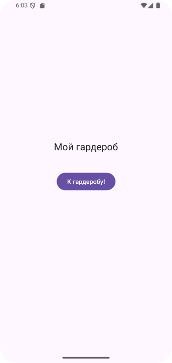
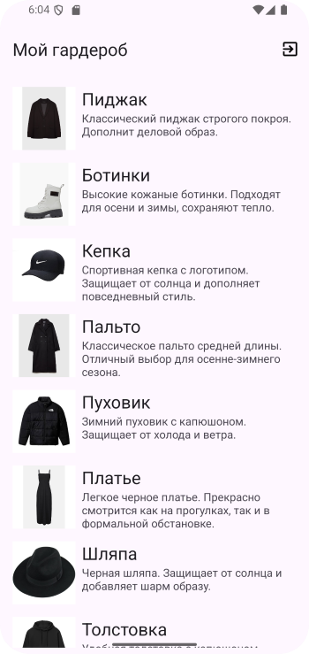
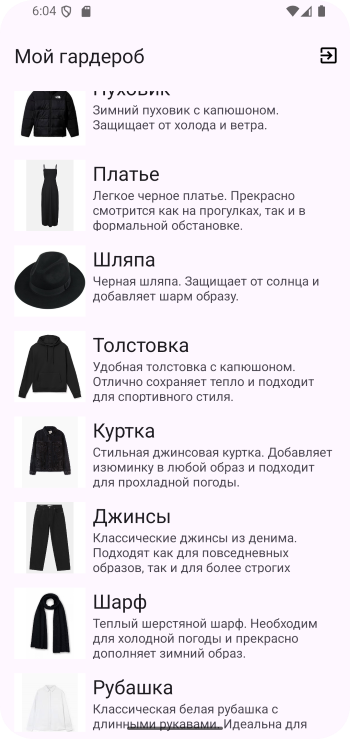
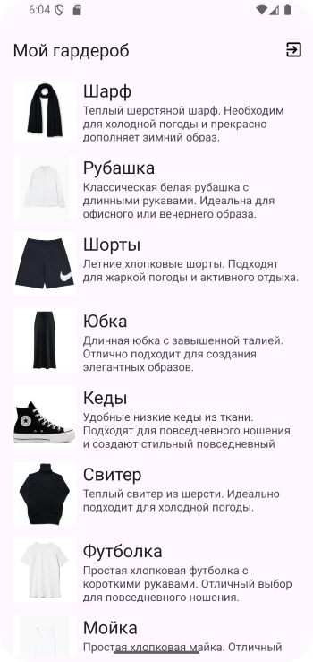
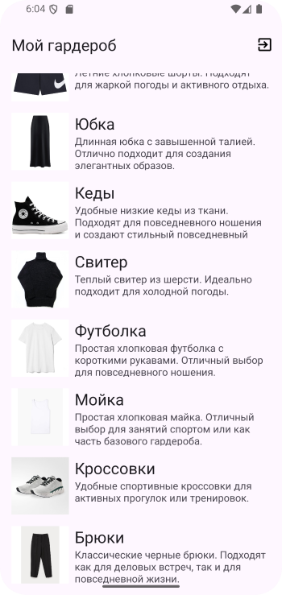
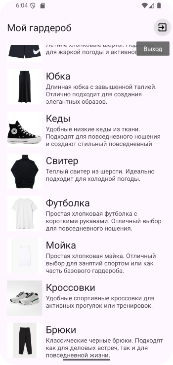

# Домашнее задание по теме "RecyclerView clickListener"

Дорабатываем свой список **«Мой гардероб»** на основе элемента **RecyclerView**. Он состоит из трех экранов: экрана приветствия и экрана приложения со списком. На основном экране список, в котором ячейка списка включает **изображение** и **название**. (только два элемента из трех). Для этого необходимо создать класс модели с полями изображения, названия и описания, а также список из объектов этого класса. Изображения могут быть скачаны в папку **drawable**. Список должен состоять не менее чем из 20 элементов.

При нажатии на элемент списка выполняется переход на третий кран детализации, на котором располагается изображение элемента гардероба, название и описание элемента гардероба. При нажатии на экран детализации выполняется вызов диалогового окна для обновления данных с двумя кнопками **«Обновить»** и **«Отмена»**. Необходимо реализовать логику обновления данных или их правки (согласно тематики занятия).

Необходимо предусмотреть создание файла элемента списка с соответствующими элементами этого списка для создания адаптера, а также файла для создания диалогового окна.

Для работы приложения необходимо создать:

***На первом экране:***

1. Заголовок приветствия **«Мой гардероб»**, это поле вывода **TextView**.

2. Кнопка **«К гардеробу»** для перехода на второй (основной) экран.

***На втором экране:***

1. Toolbar с заголовком **«Мой гардероб»**.

2. **RecyclerView** для отображения списка одежды.

3. Пункт меню **«Exit»** для выхода из приложения.

***На третьем экране:***

1. Toolbar с заголовком **«Мой гардероб»**.

2. **ImageView, TextView, TextView** для отображения информации о элементе гардероба.

3. Кнопка **«Назад»**.

4. Пункт меню **«Exit»** для выхода из приложения.

Приложение необходимо сохранить проектом в удаленном репозитории, для проверки качества предоставить ссылку преподавателю, либо сделать скрины эмулятора при каждом шаге работы приложения или снять видео экрана при работе приложения.

## Скриншоты домашнего задания по теме "RecyclerView clickListener"

Скриншоты здесь

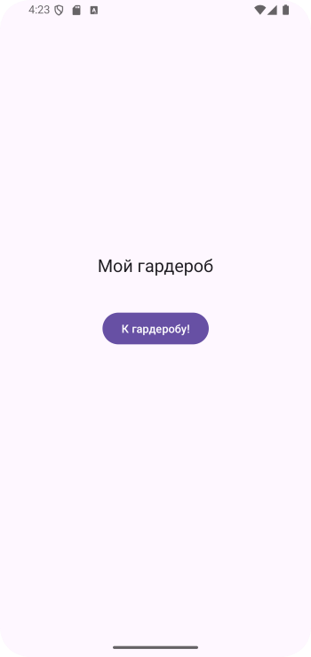
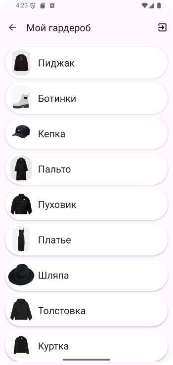
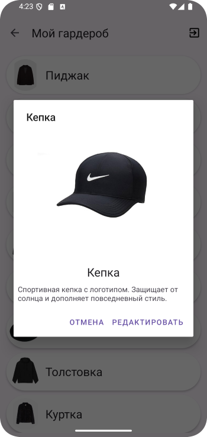
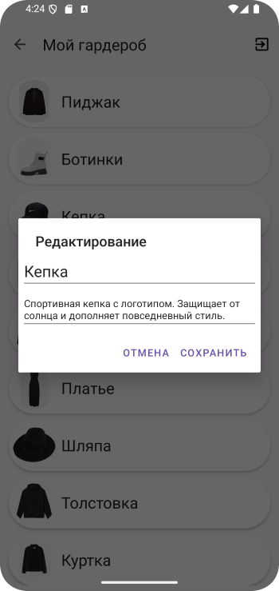
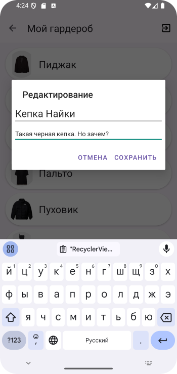
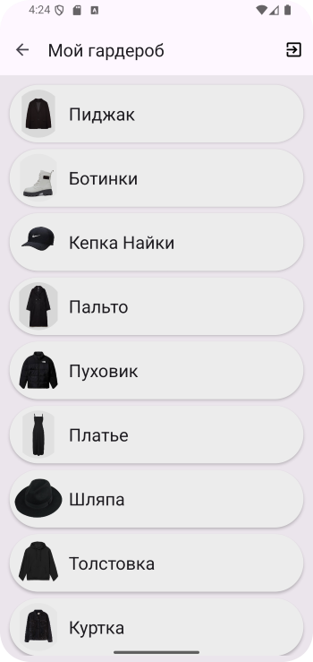

